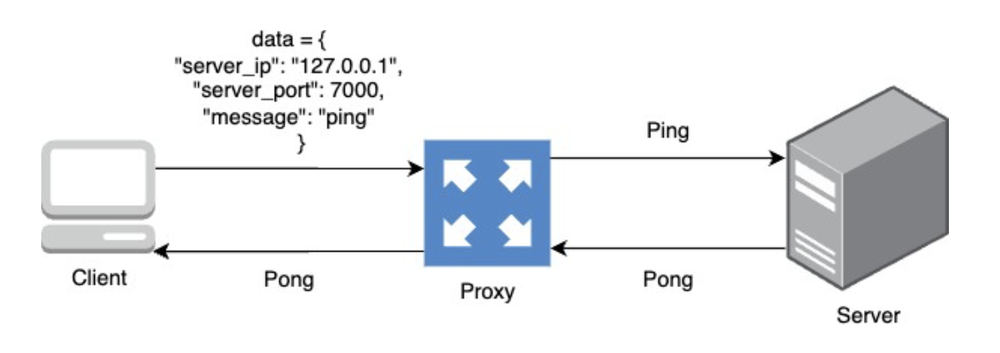
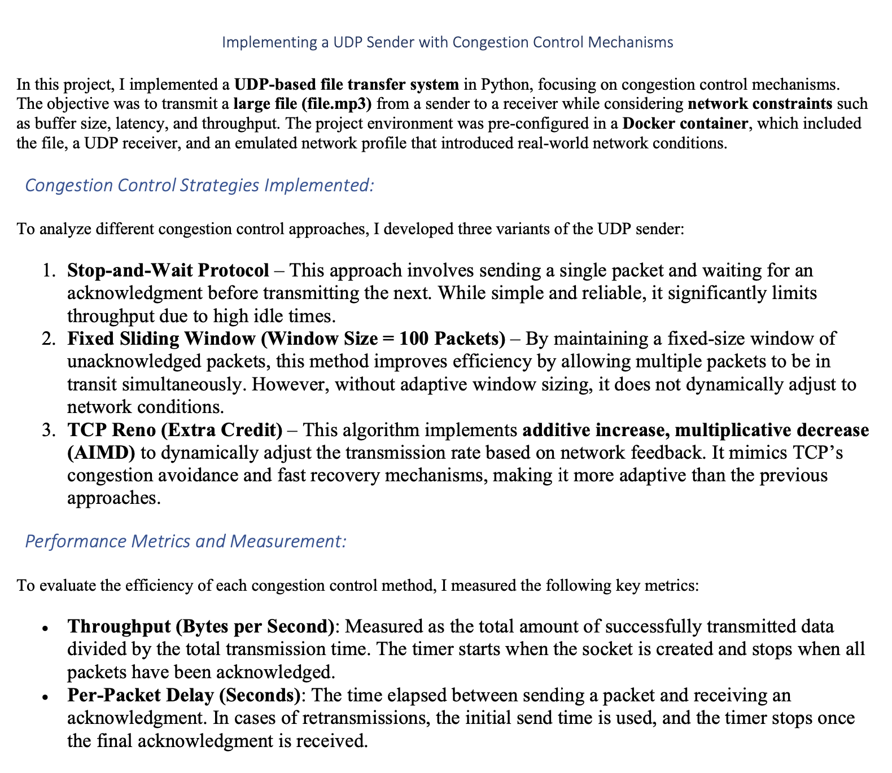

# Networking Systems Project: iPerf, Proxy Server, DNS Client, Congestion Control & BGP Analysis

---

## Project Overview

This comprehensive networking systems project covers multiple practical implementations and analyses:

1. **iPerf UDP Client/Server**: Python-based UDP client-server for measuring throughput.
2. **Proxy Server**: TCP proxy that forwards client messages to the server with IP blocking.
3. **DNS Client from Scratch**: Custom DNS client implementing DNS request and response parsing.
4. **Congestion Control Protocols**: Implementation and analysis of Stop-and-Wait, Sliding Window, and TCP Reno protocols.
5. **BGP Analysis**: Examination and analysis of BGP Routing Information Base (RIB).

---

## Learning Objectives

Through this project, I'm gaining experience in:

- **Socket Programming** (TCP & UDP)
- **Throughput and Performance Measurement**
- **Proxy Server Architecture & Security Measures**
- **DNS Protocol Implementation**
- **Congestion Control Mechanisms**
- **BGP Routing Analysis**

---

## Project Components

### 1. iPerf UDP Client-Server
- **UDP Server:** Receives data, calculates throughput, returns results.
- **UDP Client:** Sends data payloads (25-200 MB) and displays received throughput.

### 2. Proxy Server
- **TCP Proxy:** Forwards messages from client to server.
- **IP Blocking:** Rejects requests based on a configurable IP blocklist.
- **JSON Data Exchange:** Structured message transmission.

### 3. DNS Client Implementation
- **Custom DNS Requests:** Constructs DNS queries from scratch.
- **RTT Measurement:** Calculates round-trip times to DNS resolvers and web servers.
- **Response Parsing:** Extracts DNS records and associated IP addresses.

### 4. Congestion Control Analysis
- **Protocols:** Implements Stop-and-Wait, Sliding Window, and TCP Reno.
- **Performance Metrics:** Measures throughput, per-packet delay, and overall performance metrics.
- **Statistical Analysis:** Reports averages and standard deviations from multiple runs.

### 5. BGP Routing Analysis
- **BGP RIB Examination:** Parses and analyzes routing tables using data from RouteViews.
- **Longest Route Identification:** Determines longest AS path from provided BGP data.

---

## Project Structure

```
project_root/
├── udp_server.py         # UDP Server for throughput testing
├── udp_client.py         # UDP Client for sending payloads
├── proxy_server.py       # TCP Proxy server with IP blocking
├── tcp_server.py         # TCP Server receiving via proxy
├── tcp_client.py         # TCP Client communicating via proxy
├── dns_client.py         # Custom DNS client implementation
├── congestion_control/   # Congestion control protocols implementation
│   ├── stop_and_wait.py
│   ├── sliding_window.py
│   └── tcp_reno.py
└── bgp_analysis.py       # BGP routing table analysis
```

---

## Project Screenshots






---

## Running the Project

### iPerf UDP Client-Server
Run UDP server:
```bash
python udp_server.py
```
Run UDP client:
```bash
python udp_client.py [payload size in MB]
```

### Proxy Server
Run TCP server:
```bash
python tcp_server.py
```
Run Proxy server:
```bash
python proxy_server.py
```
Run TCP client:
```bash
python tcp_client.py [4-char message]
```

### DNS Client
```bash
python dns_client.py
```

### Congestion Control
Select and run desired protocol (e.g., Stop-and-Wait):
```bash
python congestion_control/stop_and_wait.py
```

### BGP Analysis
```bash
python bgp_analysis.py
```

---

## Future Enhancements

- Implement dynamic IP blocklist updates for proxy.
- Expand DNS client capabilities with additional record types.
- Optimize congestion control protocols for different network scenarios.
- Provide real-time BGP route monitoring and analysis.

---

## License

Licensed under the MIT License – see [LICENSE](LICENSE) file for details.

---

**[Back to top](#networking-systems-project-iperf-proxy-server-dns-client-congestion-control--bgp-analysis)**

